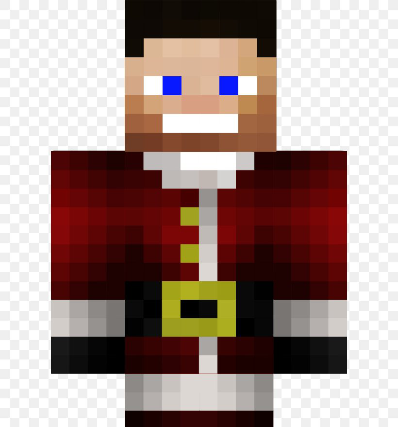

<!-- PROJECT LOGO -->
 

  

  <h3 align="center">Custom NPC</h3>

  

    The best POCKETMINE-MP <strong>NPC</strong> plugin in terms of <strong>features and ease</strong> of use.
     
     
    <a href="https://github.com/HighestDreams/CustomNPC/issues">Report Bug</a>
    ·
    <a href="https://github.com/HighestDreams/CustomNPC/issues">Suggest Your Idea</a>
  

<!-- TABLE OF CONTENTS -->

  
Quick Access Table

  <ol>
    <li>
      <a href="#about-the-project">About The Project</a>
    </li>
    <li>
      <a href="#getting-started">Getting Started</a>
      <ul>
        <li><a href="#prerequisites">Prerequisites</a></li>
        <li><a href="#installation">Installation</a></li>
      </ul>
    </li>
    <li><a href="#features">Features</a></li>
  </ol>

<!-- ABOUT THE PROJECT -->
## About The Project

There are many npc/slapper plugin available for pocketmine-mp, however, I didn't find one that really suit my needs! so I created this enhanced one. I want to create a npc plugin so amazing that it'll be the last one you ever need -- I think this is it! isn't it? 😜.

Here's why:
* Don't need to use commands for upgrading npc stuff like size/name/skin and more.
* NPCs are fully customizable and you can do all the steps with UI forms.
* Great features and much more!.

Of course, no one plugin will serve all servers since your needs may be different. So I'll be adding more in the near future. You may also suggest changes by forking this repo and creating a pull request or <a href='https://github.com/HighestDreams/CustomNPC/issues/new'>opening an issue</a>. Thanks to all the people have contributed to expanding this plugin!

<!-- GETTING STARTED -->
## Getting Started

To install this plugin, follow these simple example steps.

### Prerequisites

This is an important thing you must know before installing this plugin! there is only one command for this plugin <code>/npc</code> wich is used to spawn NPCs! Also this commands have only one arg <code>/npc edit</code> wich is used to enable/disable editor mode! 

  <li>Editor mode: After spawning npc, you need to use command <code>/npc edit</code> to enable editor mode and editting npcs (Also for disable editor mode, run this command again).</li>

### Installation

1. Download [Last Update Of Plugin](https://poggit.pmmp.io/p/CustomNPC).
2. Copy downloaded file and Paste it in <code>plugins</code> folder.
3. Run your server, its installed! but if you followed these steps and you get an error, <a href='https://github.com/HighestDreams/CustomNPC/issues/new'>open issue</a> and tell me what is the error, I will help you as soon as i can.
4. Also you can change plugin configuration in <code>plugins_data/CustomNPC/Settings.yml</code>.

<!-- features EXAMPLES -->
## Features

<strong>Some features</strong> of this plugin :

<li>Full UI customization! 🔥</li> 
<li>Custom NPC size/scale! 🔥</li>
<li>NPCs are full customizeable! 🔥</li>
<li>You can add customized capes! 🔥</li>
<li>Can set cooldown for each NPC! 🔥</li>
<li>NPCs can do emotes (+20 emotes)! 🔥</li>
<li>Can set rotation (Can look at players) for each NPC! 🔥</li>
<li>Change the skin of NPC to the skin of an online player with dropdown! 🔥</li>
<li>Can pair interactions with commands (When you right click on NPC, execute all commands)! 🔥</li>
<li>Can upair interactions with commands (When you right click on NPC, execute only interactions! not commands)! 🔥</li>
<li><strong>AND MORE!<strong></li>

<!-- MARKDOWN LINKS & IMAGES -->
<!-- https://www.markdownguide.org/basic-syntax/#reference-style-links -->
[contributors-shield]: https://img.shields.io/github/contributors/othneildrew/Best-README-Template.svg?style=for-the-badge
[contributors-url]: https://github.com/othneildrew/Best-README-Template/graphs/contributors
[forks-shield]: https://img.shields.io/github/forks/othneildrew/Best-README-Template.svg?style=for-the-badge
[forks-url]: https://github.com/othneildrew/Best-README-Template/network/members
[stars-shield]: https://img.shields.io/github/stars/othneildrew/Best-README-Template.svg?style=for-the-badge
[stars-url]: https://github.com/othneildrew/Best-README-Template/stargazers
[issues-shield]: https://img.shields.io/github/issues/othneildrew/Best-README-Template.svg?style=for-the-badge
[issues-url]: https://github.com/othneildrew/Best-README-Template/issues
[license-shield]: https://img.shields.io/github/license/othneildrew/Best-README-Template.svg?style=for-the-badge
[license-url]: https://github.com/othneildrew/Best-README-Template/blob/master/LICENSE.txt
[linkedin-shield]: https://img.shields.io/badge/-LinkedIn-black.svg?style=for-the-badge&logo=linkedin&colorB=555
[linkedin-url]: https://linkedin.com/in/othneildrew
[product-screenshot]: images/screenshot.png
